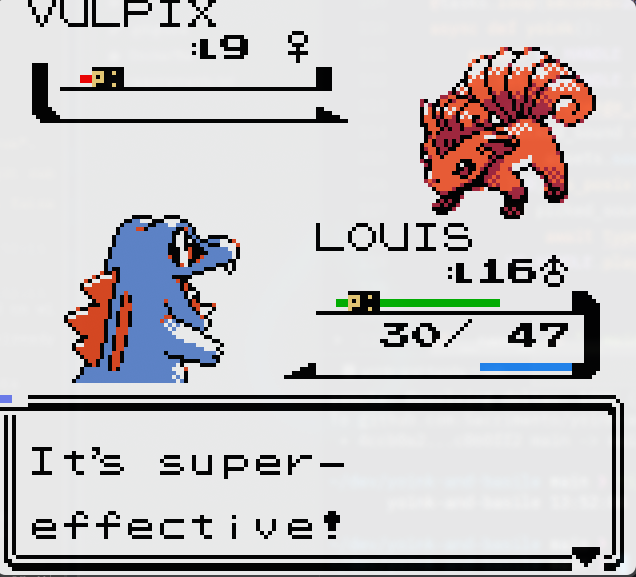

# xenogb

Yet another Gameboy Color Emulator written in Rust, based on https://gbdev.io/pandocs/


## QuickStart

You can clone this repository and build it using `cargo build --release`.
Running the emulator can be done either via `cargo run --release -- <opts>`, or by running the generated binary found in `target/release`.

> [!NOTE]  
> As of february 2026, xenogb is exclusively tested & developed on linux platforms. Windows targets should compile fine while webasm targets are not yet supported. 

### Options

xenogb comes with a list of builtin options

```
Usage: xenogb [OPTIONS] --cartridge <CARTRIDGE>

Options:
  -c, --cartridge <CARTRIDGE>             Path to the cartridge
      --headless                          Run the emulator without interface
      --stop-condition <STOP_CONDITION>   Stop the emulation on specific conditions
  -s, --serial                            Outputs the serial port to the terminal
  -b, --boot-rom <BOOT_ROM>               Starts the emulation with a boot ROM (choose from none, dmg0, dmg, mgb)
  -d, --debug                             Enable debug window
      --record                            Record the inputs made during emulation
      --record-path <RECORD_PATH>         Output path of the recorded inputs
      --replay-path <REPLAY_PATH>         Path to emulation inputs file and replay the inputs
  -h, --help                              Print help
  -V, --version                           Print version
```

## Keybindings

### Gameplay Keybindings

| Key on Keyboard    | Emulator Key       |
| ------------------ | ------------------ |
| A                  | A                  |
| S                  | B                  |
| Up/Down/Left/Right | Up/Down/Left/Right |
| Space              | Select             |
| Enter              | Start              |

### General Keybindings

| Key on Keyboard   | Emulator Action                     |
| ----------------- | ----------------------------------- |
| Ctrl+D            | Enable/disable debugger             |

## Implemented


* CPU
  - All instructions correct
  - Double speed mode
* GPU
  - Normal mode
  - Color mode
* Keypad
* Timer
* Audio
* MMU
  - MBC-less
  - MBC1
  - MBC3 (with RTC)
  - MBC5
  - save games
* Printing

## Debugger

xenogb comes with a builtin debugger. Its main features are
- A GDB like interface, to inspect the ROM's assembly and place breakpoints
- A full CPU stats page, displaying registers, states, clock stats
- An APU visualizer and mixer
- A VRAM visualizer, capable of inspecting sprites in memory

## Testing

The emulation is unit tested using a subset of https://github.com/retrio/gb-test-roms/tree/master.
Test suites can be run via the scripts in `tests/*/run.sh`

## Roadmap

- Fix various CGB bugs
- Support DMG compatibility mode
- Improve debugger usability (memory tweaking, state rewrite)
- Support TAS features (per frame emulation, input rewrite, etc)
- Support Windows & WebASM targets

## Gallery


